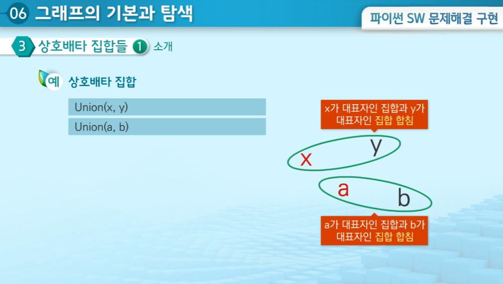
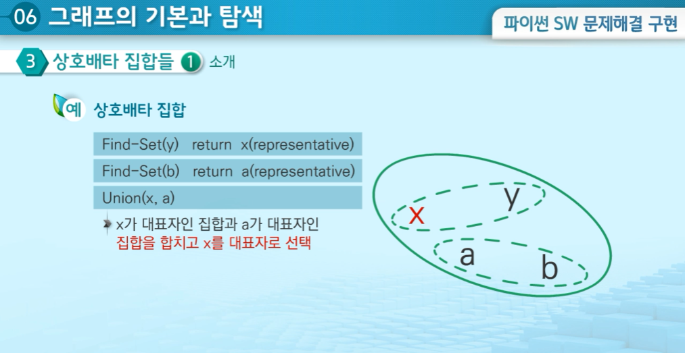
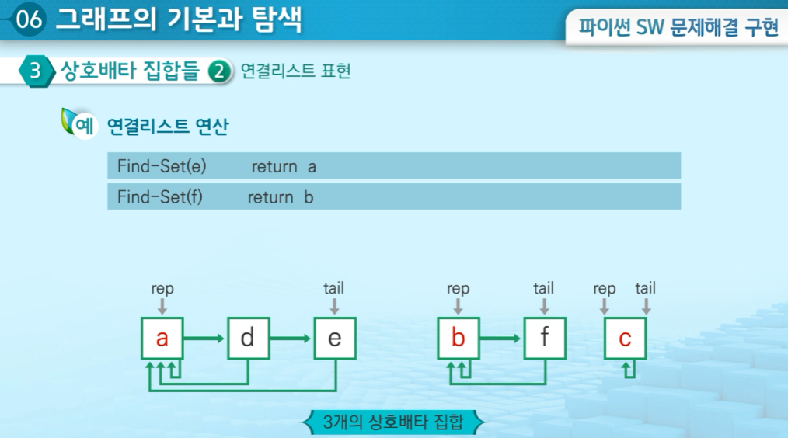

# 그래프 기본


## 1. 그래프 기본


- 친구 관계 문제
  - A 의 친구 중에 친구가 가장 많은 친구는 누구인가?

- 그래프 : 정점들의 집합과 정점을 연결하는 간선들의 집합으로 구성된 자료 구조
  - V 개의 정점을 가지는 그래프는 최대 V(V-1) / 2 간선이 가능


- ##### 무향 그래프와 유향 그래프


- ##### 가중치 그래프(유향 그래프의 하위 개념)


- ##### 인접과 부분 그래프

  - 인접 : 한 정점에서 다른 한 정점으로 이동이 가능하다면 인접하여 있다고 함
  - 부분 그래프 : 원래 그래프에서 일부만을 표현한 그래프


- ##### 경로, 단순경로, 사이클


---


## 2. 그래프 표현


- #### 인접 행렬

  - |V| x |V| 크기의 2차원 리스트를 이용해서 간선 정보 저장

##### -> 정점의 개수가 7개이고 간선의 개수가 8개인 그래프


##### -> 유향 그래프의 경우


- 인접 행렬의 단점
  - 정점의 개수 n이 커지면 <span style = "color:red">**인접 행렬에 필요한 메모리 크기는 n^2에 비례**</span>해서 커짐
  - 어떤 정점의 인접 정점을 찾을 때마다, <span style = "color:red">**천 개의 슬롯을 조사**</span>해야 함


- #### 인접 리스트

  - 각 정점마다 인접 정점으로 나가는 간선의 정보 저장


- 인접 리스트의 단점
  - 행렬보다는 적지만 불필요한 메모리 사용과 인접정점을 찾는 비용이 든다.
  - 극복 방안
    - 각 정점에 대한 인접 정점들을 순차적으로 표현
    - 하나의 정점에 대한 인접 정점들을 각각 노드로 하는 연결 리스트로 저장


---

---


## 3. 그래프 탐색


- ### 그래프 순회

  - 비선형구조인 그래프로 표현된 모든 정점을 빠짐없이 탐색
  - 그래프 탐색의 대표적인 방법
    - 깊이 우선 탐색(DFS)
    - 너비 우선 탐색(BFS)


- ### 깊이 우선 탐색(Depth First Search, DFS)

  - 시작 정점에서 갈 수 있는 한 방향을 선택해서 다음 정점으로 이동 
  - 선택된 정점에서 다시 위와 같은 작업을 <span style = "color:red">**반복 수행**</span> 하면서 갈 수 있는 경로가 있는 곳까지 깊이 탐색 (이 때, 이미 방문했던 정점은 재방문하지 않음)
  - 더 이상 갈 곳이 없으면, 가장 최근에 방문한 갈림길이 있는 정점으로 되돌아와서 다른 방향의 정점으로 탐색을 계속 반복하여 <span style = "color:red">**결국 모든 정점을 방문하는 순회방법**</span>
    - <span style = "color:red">**후입선출 구조의 스택 사용**</span> 하거나 <span style = "color:red">**재귀 호출**</span> 을 이용해서 구현


```python
def dfs(arr, s, visited):
    # 가지치기 넣는 자리
	visited[s] = True
    print(s, end=' ') 	# print 대신에 원하는 연산을 실행
    
    for i in arr[s]:
        if not visited[s]:
            visited[i] = True
            dfs(arr, i, visited)
            visited[i] = False
```


- 너비 우선 탐색( ,BFS)
  - 탐색 시작점의 <span style = "color:red">**인접한 정점들**</span>을 먼저 <span style = "color:red">**모두 차례로 방문**</span>
  - 방문했던 정점들을 다시 시작점으로 하여 위의 과정을 <span style = "color:red">**반복 수행**</span> (이 때, 이미 방문한 정점은 재방문하지 않음)
    - <span style = "color:red">**선입선출 구조의 큐 사용**</span> 해서 구현

​		

```python
def bfs(arr, s, visited):
    queue = [s]
    visited[s] = True
    front = -1
    rear = 0
    
    while front != rear:
		front += 1
        v = queue[front]
        print(v, end=' ')	# print 대신에 원하는 연산을 실행
        
        for i in arr[v]:
            if not visited[i]:
                visited[i] = True
                queue.append(i)
```


---

---


## 상호배타 집합들


- #### 서로소 또는 상호배타 집합들

  - 서로 중복 포함된 원소가 없는 집합들로 <span style = "color:red">**교집합이 없음**</span> 
  - 집합에 속한 하나의 특정 원소를 통해 각 집합들을 구분
    - 특정 원소 - 대표자(Representative)
  - 상호배타 집합을 표현하는 방법
    - 연결 리스트
    - 트리


- #### 상호배타 집합 연산

  - Make-Set(x) - 원소 x만으로 구성된 집합을 생성하는 연산
  - Find-Set(x) - 임의의 원소 x가 속한 집합을 알아내기 위해 사용하며, 집합의 대표자를 알기 위한 연산
  - Union(x, y) - x 원소가 속한 집합과 y 원소가 속한 집합을 하나의 집합으로 합치는 연산
    - 교집합이 존재하지 않기 때문에 교집합에 대한 연산은 없음


- ##### Make-Set( )


- ##### Union( )




- ##### Find-Set( )




- ### 연결리스트 연산




- Union 연산을 사용할 때 <span style = "color:red">**크기가 작은 집합을 큰 집합의 뒤에 연결**</span> 
  - 뒤에 붙는 노드들이 크기가 큰 집합의 대표자를 가르키도록 수정이 필요(효율적)


- ### 트리 표현


- ##### 하나의 집합을 하나의 트리로 표현

  - 자식 노드가 부모 노드를 가리키며 로트 노드가 대표자가 됨


- #### 상호배타 집합을 트리로 표현 시 문제점과 해결방법


- ### 연산의 효율을 높이는 방법


- #### Rank를 이용한 Union

  - 각 노드는 자신을 루트로 하는 Subtree의 높이를 Rank라는 이름으로 저장
  - 두 집합을 합칠 때 Rank가 낮은 집합을 Rank가 높은 집합에 붙임


- ##### Rank값의 변경이 필요한 경우


- #### Path compression

  - Find-Set 을 행하는 과정에서 만나는 모든 노드들이 직접 Root를 가리키도록 부모 정보를 변경


- Make_Set( ) 연산 코드

```python
def Make-Set(x)
	p[x] = x
    rank[x] = 0
```


- Find_Set( ) 연산 코드

```python
def Finde-Set(x)
	while x != p[x]
    	x = p[x]
   	return x
```


- Union( ) 연산	( p[find-set(5)] = find-set(3) ) => p[4] = 2

```python
def Union(x, y)
	p[Find-Set(y)] = Find-Set(x)
```


- 활용사례
  - 도로망으로 연결된 마을 확인 문제
  - 가장 큰 집합 추적하기
  - 집합의 노드 개수가 몇 개 이상 되는 시점 찾기
  - KRUSKAL Minimum Spaning Tree(MST) 알고리즘

