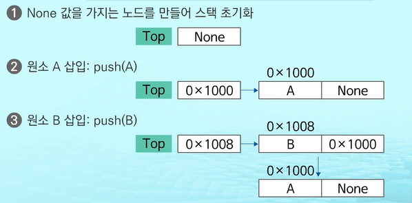

# 리스트

순서를 가진 데이터의 묶음 - 같은 데이터의 중복 저장 가능

시퀀스 자료형 - 인덱싱, 슬라이싱, 연산자, 메서드 사용 가능

크기제한 없음, 타입 제한 없음

리스트는 크기 변경이 가능하고, 다양한 데이터 타입을 저장 가능

(배열은 크기 변경이 불가능하고, 선언된 한가지 타입만 저장가능)


## 리스트 종류

### 순차리스트

초기화 및 생성: 변수에 값을 초기화는 것으로 리스트 생성

데이터 접근: 리스트의 인덱스를 이용해 원하는 위치의 데이터를 변경하고 참조할 수 있음

리스트: 동적 배열로 작성된 순차 리스트

자료의 삽입,삭제연산: 원소의 이동 작업 필요 -> 시간이 많이 걸림


리스트 복사:

여러가지 방법 존재, 수행시간의 차이가 있고, 의미가 다른 항목 존재


2번을 가장 추천, 7번이 가장 많이 시간이 걸리지만 원본리스트에 포함된 원소들의 객체까지도 깊은 복사를 해줌


### 연결 list

리스트의 단점을 보완한 자료구소

자료의 논리적인 순서와 메모리 상의 물리적인 순서가 일치하지않고, 개별적으로 위치하고 있는 원소의 주소를 연결하여 하나의 전체적인 자료구조를 이룸

링크를 통해 원소에 접근하므로, 순차 리스트에서 물리적인 순서를 맞추기 위한 작업이 필요하지 않음

자료구조의 크기를 동적으로 조절할 수 있어, 메모리의 효율적인 사용 가능

연결 리스트에서 탐색을 하려면 순차 탐색을 해야함


```
그냥 일반 리스트가 철수 1번, 영희 2번, 민수 3번, 순이 4번 -- 이런식이라면
연결 리스트는 철수 다음 영희, 영희 다음 민수, 민수 다음 순이 식으로 자료 연결 해놓은것
연결리스트는 자료 번호가 없이 그저 연결 관계만 있기 때문에 특정한 노드를 불러내기 어려운 단점이 있음
```


* 주요 함수


* 구성 요소
  * 노드
    * 연결리스트에서 하나의 원소에 필요한 데이터를 갖고 있는 자료단위
      * 데이터 필드: 원소의 값을 저장하는 자료구조
      * 링크 필드: 다음 노드의 주소를 저장하는 자료 구조
  * 헤드
    * 리스트의 처음 노드를 가리키는 링크 필드만 가지고 있음
    * 헤드 자체에는 데이터가 저장되지 않음


```
node: 데이터와 다음 데이터를 가리키는 주소(포인터)로 이루어져있음
pointer: 각 노드에서 다음 데이터를 가리키는 주소값을 의미
head: linked_list에서 가장 시작점인 데이터
tail: linked_list에서 가장 마지막 데이터 의미
next = None: 다음 데이터가 없을 경우 포인터의 주소값은 None이다.
```


* 단순 연결 리스트

  : 노드가 하나의 링크 필드에 의해 다음 노드와 연결되는 구조를 가짐

  헤드가 가장 앞의 노드를 가리키고, 각 노드의 링크 필드가 연속적으로 다음 노드를 가리킴

  최종적으로 None을 가리키는 노드가 리스트의 가장 마지막 노드임

  

 

* 단순 연결 리스트의 삽입 연산

a, c, d를 원소로 갖고 있는 리스트의 두번째에 b 노드 삽입하는 것을 어떻게 할까요?

1. 메모리 할당하여 새로운 노드 new 생성


2. 새로운 노드 new의 데이터 필드에 'b'저장

3. 새로운 노드가 삽입될 위치의 바로 앞에 위치한 노드의 링크 필드를 new에 복사


4. new의 주소를 앞 노드의 링크 필드에 저장


첫번째 노드로 삽입하는 알고리즘

```python
def addtoFirst(data): # 첫 노드에 데이터 삽입
    global Head
    Head = Node(data, Head) # 새로운 노드 생성
```

노드 pre의 다음 위치에 노드 삽입

```python
def add(pre, data): # pre 다음에 데이터 삽입
    if pre == None:
        print('error')
    else:
        pre.link = Node(data, pre.link)
```

마지막 노드로 삽입하는 알고리즘

```python
def addtoLast(data): # 마지막에 데이터 삽입
    global Head
    if Head == None: # 빈리스트이면
        Head = Node(data, None)
    else:
        p = Head
        while p.link != None: # 마지막 노드 찾을 때까지 = 링크가 none일때까지
            p = p.link
        p.lint = Node(data, None)
```


* 단순 연결 리스트의 삭제 연산

a, b, c, d 리스트의 b 노드 삭제

1. 삭제할 노드의 앞 노드(선행노드) 탐색


2. 삭제할 노드의 링크 필드를 선행노드의 링크 필드에 복사


첫번쨰 노드를 삭제하는 알고리즘

```python
def deletetoFirst():
    global Head
    if Head == None:
        print('error')
    else:
        Head = Head.link
```

노드 pre의 다음 위치에 있는 노드 삭제

```python
def delete(pre):
    if pre == None or pre.link == None:
        print('error')
    else:
        pre.link = pre.link.link
```


연결 리스트의 경우 한번 링크를 따라가기 시작하면 다시 돌아오는 것이 불가능, 타겟인 노드를 지나쳤다면 다시 헤드부터 살펴봐야함. 이를 보완하기 위한 방법으로 이중연결 리스트 

[linked_list코드](https://underflow101.tistory.com/3?category=826162)


* 이중 연결 리스트

: 양쪽 방향으로 순회할 수 있도록 노드를 연결한 리스트

두개의 링크 필드와 한 개의 데이터 필드로 구성


cur이 가리키는 노드 다음에 d값을 가진 노드 삽입

1. 메모리 할당하여 새로운 노드 new 생성, 데이터 필드에 d 저장


2. cur의 next를 new의 next에 저장하여 cur의 다음 노드를 삽입할 노드의 다음 노드로 연결


3. new의 값을 cur의 next에 저장하여 삽입할 노드를 cur의 다음 노드로 연결

   

4. cur의 값을 new의 prev 필드에 저장하여 cur를 new의 이전 노드로 연결


5. new의 값을 new가 가리키는 노드의 다음 노드의 prev 필드에 저장하여 삽입하려는 노드의 다음 노드와 삽입하려는 노드를 연결


cur이 가리키는 노드를 삭제하는 과정

1. 삭제할 노드의 다음 노드의 주소를 삭제할 노드의 이전 노드의 next 필드에 저장하여 링크 연결


2. 삭제할 노드의 다음 노드의 prev 필드에 삭제할 노드의 이전 노드의 주소를 저장하여 링크를 연결


3. cur이 가리키는 노드에 할당된 메모리 반환


[더블 linked_list 코드](https://underflow101.tistory.com/4)


# 삽입정렬

연결 리스트를 이용한 정렬 방법

도서관 사서가 책을 정렬할 때, 사용하는 방식

자료 배열의 모든 원소들을 앞에서부터 차례대로 이미 정렬된 부분과 비교하여, 자신의 위치를 찾아냄으로써 정렬을 완성 

n의 개수가 작을 때 효과적임


# 병합정렬

여러개의 정렬된 자료의 집합을 병합하여 한개의 정렬된 집합으로 만드는 방식

분할 정복 알고리즘 활용 - 자료를 최소 단위의 문제까지 나눈 후에 차레대로 정렬하여 최종 결과를 얻어냄

연결 list의 경우 가장 효율적인 방식


알고리즘

1. 분할 과정

```python
def merge_sort(m):
    if len(m) <= 1:
        return m
    mid = len(m) //2
    left = m[:mid]
    right = m[mid:]
    
    left = merge_sort(left)
    right = merge_sort(right)
    
    return merge(left, right)
```

2. 병합과정

```python
def merge(left, right):
    result = []
    
    while len(left) > 0 and len(right) > 0:
        if left[0] <= right[0]:
            result.append(left.pop(0))
        else:
            result.append(right.pop(0))
    
    if len(left) > 0:
        result.extend(left)
    if len(right) > 0:
        result.extend(right)
    return result
```


# linked list의 활용

* 스택의 원소: 리스트의 노드
  * 스택 내의 순서는 리스트의 링크를 통해 연결됨
  * push: 리스트의 마지막에 노드 삽입
  * pop: 리스트의 마지막 노드 반환/ 삭제
* 변수 top
  * 리스트의 마지막 노드를 가리키는 변수
  * 초기 상태: top = None


리스트를 이용해 push와 pop 연산 구현




push / pop 연산 알고리즘

```python
def push(i):
    global top
    top = Node(i, top)
    
def pop():
    global top
    
    if top == None:
        print('error')
    else:
        data = top.data
        top = top.link
        return data
```


순차리스트를 이용한 우선순위 큐 구현

순차리스트를 이용하여 자료를 저장하는데 원소를 삽입하는 과정에서 우선순위를 비교하여 적절한 위치에 삽입하는 구조이다. 가장 앞에 최고 우선순위의 원소가 위치하게 되는데 문제점이 발생!

문제: 배열을 사용하므로 원소의 재배치가 발생해 시간, 메모리 낭비가 큼


따라서 연결 리스트를 이용한 우선순위 큐 구현이 유리

연결리스트를 이용하여 자료저장함, 원소를 삽입하는 과정에서 리스트 내 노드의 원소들과 비교하여 적절한 위치에 노드를 삽입하는 구조이다. 리스트의 가장 앞쪽에 최고 우선순위가 위치하게 됨

배열 대비 장점: 원소 재배치가 필요x , 메모리 효율적 사용 가능