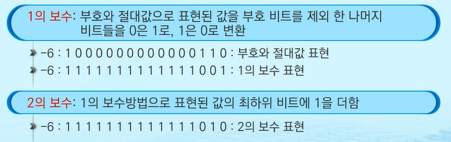
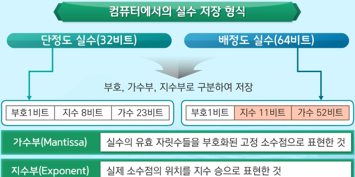

# start

## sw 문제 해결

문제 해결 과정 단계

1. 문제를 읽고 이해
2. 문제를 익숙한 용어로 재정의
3. 어떻게 해결할지 계획
4. 계획 검증
5. 프로그램으로 구현
6. 개선 방법 찾기


문제 해결 전략

1. 직관, 체계적인 접근

2. 비슷한 문제를 풀어본 적이 있는가?

3. 단순한 방법이 있나?

4. 문제 단순화, 시각화가 가능한가?

5. 문제 분해 가능?

6. 뒤에서부터 생각해서 문제 풀수 있을 까?


## 알고리즘 복잡도

알고리즘: 유한한 단계를 통해 문제를 해결하기 위한 절차나 방법

어떤 일을 수행하기 위한 단계적 방법


알고리즘은 다양한 방법이 있다. 다양한 알고리즘 효율을 찾아야함

메모리 공간을 얼마나 차지하는가, 얼마나 많은 시간을 필요하는가

복잡도가 높을수록 효율성 저하


점근적 표기 사용

입력 크기 n이 무한대로 커질 때의 복잡도를 간단히 표현하기 위해 사용하는 방법

빅오, 빅오메가, 빅세타 표기

1. 빅오

- 복잡도의 점근적 상한을 나타냄
- 다항식의 최고차항만 계수 없이 취한것

2. 빅오메가

* 복잡도의 점근적 하한을 의미
* 복잡도 다항식의 최고차항만 계수 없이 취함
* "최소한 이 시간은 걸린다를 의미"

3. 빅세타

* 빅오 표기와 빅오메가 표기가 같은 경우에 사용


*시간 복잡도 구하기 중요 *

___


## 비트 연산자


비트 연산 적용 시 연산 속도 향상, 메모리 절약 가능


```
* & : 둘다 1일 때 1
  *  비트 조사 : 특정비트가 1인지 확인하고 싶다
  *  ex) 10110001 & 00010000 (확인하고 싶은 자리에만 1)
     * & 연산자해서 != 0이면 그 자리는 1 맞네
  *  비트클리어: 특정 비트를 0으로 만들고 싶다
  *  ex) 10110001 뒤에서 5번째 1을 영으로 만들고 싶어 그러면
  *  ​      10101111과 & 연산자해서 영으로 만들어버림

* |: 하나라도 1이면 1
  * 비트셋: 특정비트를 1로 바꾸고 싶을때
    * ex) 10000001 | 00010000 => 10010001
* ^: 같으면 0 다르면 1
  * 특정비트가 같은지 검사
  * 10110001 ^ 10110001 => 0 다 같군!
  * 10110001 ^ 10100001 => 1 다르군!
  * 비트 토글: 비트를 반전시킬 수 있음


* ~: 피연잔사의 모든 비트를 반전시킴
* << : 피연산자의 비트 열을 왼쪽으로 이동시킴
  * num << 2: 00000001 -> 00000100
  * 2만큼 2를 곱해주는 것과 같다
  * a | 1<< 3 : a의 3번 비트를 1로 바꿔
  * a | 1<< 1 | 1 << 4| 1<< 5 : a의 1, 4, 5, 번 비트를 1로 바꿔
  * a의 3번 비트 클리어: a & ~ (1<<3)
  * a & ~(1<<3 | 1<<5) : a의 비트 3, 5를 클리어
* `>>` : 피연산자의 비트 열을 오른쪽으로 이동시킴


* 1<< n:
  * 2^n 의 값을 가진다
  * 원소가 n개일 경우의 모든 부분집합의 수를 의미한다
  * powerset: (모든 부분집합)
    * 공집합과 자기자신을 포함한 모든 부분집합
* i & (1<<j): i의 j번째 비트틀 검사 (j : 0~7 / i : 0~ 1<<n -1)
```


1<< n :  2^n의 값을 가짐

원소가 n개일 경우의 모든 부분집합의 수를 의미


i & (1 << j) : 계산 결과는 i의 j번쨰 비트가 1인지 아닌지를 의미


특정 위치의 비트값을 확인하는 수식에 대한 예제

```python
def Bitprint(i):
    for j in range(7, -1, -1):
        print('1' if (i& (1<<j)) else '0', end = "")
        # print("%d"% ((i>>j) &1), end = "")
        
       
for i in range(0, 6):
    print("%2d = " % i, end = "") # 십진수 출력
    Bitprint(i) # 2진수 출력
    print()
```

```
 0 = 00000000
 1 = 00000001
 2 = 00000010
 3 = 00000011
 4 = 00000100
 5 = 00000101
```

```
예를들어서 5라고 할 때 
5 =    00000101
1<< 7: 10000000
1<< 6: 01000000
1<< 5: 00100000
..
1<< 2: 00000100
1<< 1: 00000010
1<< 0: 00000001
```


4바이트 크기의 인트형 변수에 저장된 값들을 한 바이트씩 읽어서 비트 형태로 출력하는 예제

```python
def Bitprint(i):
    for j in range(7, -1, -1):
        print('1' if (i& (1<<j)) else '0', end = "")
        # print("%d"% ((i>>j) &1), end = "")

a = 0x10
x = 0x01020304

print("%d = " % a, end = "")
Bitprint(a)
print()

# %08x는 숫자 x를 8 hex digits로 표현
print("%08x = " % x, end = "")

for i in range(0, 25, 8):
    Bitprint(x >> i)
    print(end = " ")
```

```
16 = 0001000016
01020304 = 00000100 00000011 00000010 00000001 
```


* 엔디안

  : 컴퓨터의 메모리와 같은 1차원의 공간에 여러개의 연속된 대상을 배열하는 방법을 의미하며 HW(하드웨어) 아키텍처 마다 다름

속도향상을 위해 바이트 단위와 워드 단위를 변환하여 연산할 때 올바로 이해하지 않으면 오류를 발생시킬수 있음

1. 빅 엔디안: 보통 큰 단위가 앞에 나옴

   ​                   네트워크

2. 리틀 엔디안: 작은 단위가 앞에 나옴 

   ​                       대다수 데스크탑 컴퓨터


```python
n = 0x00111111

if n & 0x11:
    print("little endian")
else:
    print("big endian")
```

```
little endian
```

____

XOR 연산자

```python
def Bitprint(i):
    for j in range(7, -1, -1):
        print('1' if (i& (1<<j)) else '0', end = "")
        # print("%d"% ((i>>j) &1), end = "")

a = 0x86
key = 0xAA
print("a      =>  ", end = "")
Bitprint(a)
print()
print("a^=key ==> ", end = "")
a ^= key
Bitprint(a)
print()
print("a^=key ==> ", end = "")
a ^= key
Bitprint(a)
print()
```

```
a      =>  10000110
a^=key ==> 00101100
a^=key ==> 10000110
# key는    01010101
```

XOR연산자는 한번 갔다가 다시 되돌리려면 ^만 하면 됨

___


## 진수

2진수, 8진수, 10진수, 16진수

10진수를 타 진수로 변환하는 방법: 원한느 타진법의 수로 나눈 뒤 나머지를 거꾸로 읽음

타진수를 10진수로 변환하는 방법: 각 자릿값을 해당 진수의 값을 곱해서 구함


```python
num = 10
binary = ''
while num != 0:
    binary = str(num % 2) + binary
    num = num // 2
print(binary)

result = 0
for i in range(len(binary)):
    result = result * 2 + int(binary[i])
print(result)
```

```
1010
10
```


```python
# 진수 바꾸는 내장함수
num = 10

# 2진법
binary = bin(num)
print(binary)
# 0b1010
# 얘는 문자열로 받아옴

# 0b 없애고 싶으면
print(binary.replace('0b',''))
# 1010

#8진법
octal = oct(num)
print(octal.replace('0o',''))
# 12

# 16 진법
hexa = hex(num)
print(hexa.replace('0x',''))
# a

# 2진법을 10진법으로 변환
dec = int(binary, base = 2)
print(dec)
# 10

# int는 무조건 10진법으로 변환 base인자에는 본래 진수를 작성하는것! 헷갈리지 않기!
```


컴퓨터에서 음의 정수 표현 방법



2의보수를 더 많이 사용함 

1의 보수는 굳이 필요 x ->  실제로 계산할때 필요해서 쓰는거라 계산은 2의 보수로 씀

2의 보수를 가기 위한 길 중에 하나랄까

계산을 중복할 필요가 없어서 2의 보수를 더 많이 사용

 

## 2진실수


___

실수를 저장하기 위한 형식




파이썬은 배정도 실수를 사용!


[struct](https://docs.python.org/ko/3/library/struct.html)쓰는 방법

```
struct 모듈은 pack, unpack, calcsize 등의 기능이 있으며, 이것들을 사용하여 정수, 부동 소수점 숫자, 문자열(을 encode 메소드에서 인코딩 한 것)을 bytes 객체로 변환하거나 반대로 bytes 객체에서 이것을 빼낸다.
```


### 단정도 실수


```python
import struct
a = 9.187500
bits, = struct.unpack('I', struct.pack('f',a))
print(f'{bits:032b}')
```


----


### 유효 숫자

이진법으로 표현할 수 없는 형태의 실수는 정확한 값이 아니라 근사값으로 저장

근사값으로 저장될 때 생기는 작은 오차가 계산 과정에서 다른 결과를 가져옴


컴퓨터는 실수를 근사적으로 표현

실수형에서는 if a== b: 이런게 아니라 if |a-b| <= 어느정도 값: 

이정도의 오차는 넘어갈 수 있음


실수 자료형의 유효 자릿수

32 비트 실수형 유효자릿수(십진수) -> 6

64 비트 실수형 유효자릿수(십진수) -> 15


```
유효자릿수가 뜻하는 것은 정밀도를 뜻함. 즉, 몇자리까지 오차없이 표현할 수 있는 가

float의 정밀도보다 더 높은 정밀도가 필요하다면 double을 사용
```

오호.. double, long double은 java ,c 

