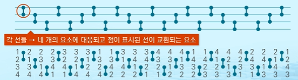
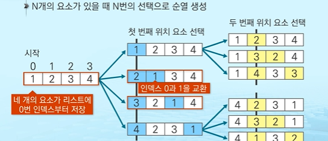

## 완전 검색

### 완전검색 기법

* 베이비진

  : 0~9 사이의 숫자 카드에서 임의의카드 6장 뽑고 

   -> 3장의 카드가 연속적인 번호 : 런

   -> 3장의 카드가 동일한 번호 : 트리플릿

   => 6장의 카드가 런, 트리플릿으로 구성된 경우 * 베이비진 *


완전 검색

: 문제의 해를 얻기 위해 가능한 모든 경우들을 나열해보고 확인하는 방법  - 간단하고 쉬운 접근법

  대부분의 문제에 적용 가능

  문제에 포함된 자료의 크기가 작을 경우 유용


순차검색

: 자료들의 리스트에서 키 값을 찾기 위해 첫번째 자료부터 비교하면서 진행

```python
def sequentialSearch(a, n, key): # 리스트 a, 길이 n, 찾는 값 key
    i = 0
    while i < n and a[i] != key:
        i = i+1
    if i < n :
        return i # 성공
    else:
        retrun -1 # 실패
```


완전검색 기법은 문제의 크기가 커지면 시간 복잡도가 매우 크게 증가

수행속도는 느리지만, 해답을 찾아내지 못할 확률이 적음

-> 그리디 기법, 동적 계획법을 이용해서 효율적인 알고리즘 찾음


그렇다면 베이비진을 푸는 방법?

1. 고려할 수 있는 모든 경우의 수 생성
2. 3장씩 나눠서 베이비진 여부 판별
3. 6개 중에 3개를 뽑아서 런 혹은 트리플릿인지 확인하고 맞다면 나머지 하나도 런혹은 트리플릿인지 확인


____

### 조합적 문제

순열, 조합, 부분집합과 같은 조합적 문제들과 관련


#### 순열

: 서로 다른 것들 중 몇개를 뽑아서 한줄로 나열하는 것

서로 다른 n개 중 r개를 택하는 순열 표현

nPr = n x (n-1) x ... x (n-r+1)


그러나 N이 10이상일 때부터 순열의 가지수는 3628800 개로 N이 1씩 증가해도 N!는 기하급수적으로 증가


따라서 단순하게 순열을 생성하는 방법

```python
# {1, 2, 3}을 포함하는 모든 순열을 생성하는 함수
for i1 in range(1, 4):
    for i2 in range(1, 4):
        if i2 != i1:
            for i3 in range(1, 4):
                if i3 != i1 and i3 != i2:
                    print(i1, i2, i3)
```

이것도 계속 증가하면 for 문을 무한적으로 중첩해야하기 때문에 힘듦

그래서 재귀를 많이 사용!


1. 사전식 순서

   요소들이 오름차순으로 나열된 형태가 시작하는 하나의 순열

   ```
   [1 2 3] [1 3 2] [2 1 3] [2 3 1] [3 1 2] [3 2 1]
   ```

2. 최소 변경을 통한 방법

   각각의 순열들은 이전의 상태에서 단지 두 개의 요소들 교환을 통해 생성

   ```
   [1 2 3] [3 2 1] [2 3 1] [2 1 3] [3 1 2] [1 3 2]
   ```

   3 과 1 교환 -> 2와 3 교환 -> ....


​      최소한의 변경을 통해 순열을 생성하는 방법 - johnson-trotter 알고리즘




​     두 원소의 교환을 통해 생성



요소의 수가 4개로 루트는 자식이 네개이고 트리의 높이가 1인 내부 노드들은 자식이 세개가 되는 구조의 트리

네번의 선택을 하기 때문에 트리의 높이는 4가 됨

재귀 호출을 통해 순열 생성

```python
a = [1, 2, 3, 4]
n = len(a)
k = 0
def perm(n,k):
    if k== n: #하나의 순열 생성
        print(a)
    else:
        for i in range(k, n):
            a[k], a[i] = a[i], a[k] # 교환을 통한 선택
            perm(n, k+1)            # 재귀 호출
            a[k], a[i] = a[i], a[k] # 이전 상태로 복귀
```


```python
import itertools
mylist = [1, 2, 3]
result = itertools.permutations(mylist)
print(list(result))
```


```python
#중복 순열
import itertools
mylist = [1, 2, 3]
result = itertools.product(mylist, repeat = 3)
print(list(result))
```


#### 부분집합

집합에 포함된 원소들을 선택하는 것

다수의 중요 알고리즘들이 원소들의 그룹에서 최적의 부분집합을 찾는것

```python
# 단순하게 모든 부분집합 생성하는 방법
arr = [2, 3, 4, 5]
bit = [0] * len(arr)
for i in range(2): # 0번쨰 원소
    bit[0] = i
    for j in range(2):# 1번쨰 원소
        bit[1] = j
        for k in range(2): # 2번쨰 원소
            bit[2] = k
            for l in range(2): # 3번쨰 원소
                bit[3] = l
                print([arr[x] for x in range(len(bit)) if bit[x]])    # 생성된 부분집합 출력 
```


비트 표현을 이용해서 부분집합을 생성하는 방법 - 바이너리 카운팅

```python
arr = [2, 3, 4,5]
n = len(arr)

for i in range(1<<n):
    for j in range(n):
        if i & (1<<j):
            print(arr[j], end = ",")
    print()
```

```python
arr = [2, 3, 4,5]
for i in range(1<<len(arr)):
    print([arr[j] for j in range(len(arr)) if i & (1<<j)])
```


#### 조합

서로 다른 n개의 원소 중 r개를 순서 없이 골라내는 것

nCr = n! / (n-r)!r!


재귀 호출을 이용한 조합 생성 알고리즘

```python
a = [1, 2, 3, 4]
n = len(a)
r = 3
tr = [] # 조합이 임시 저장될 r개의 크기의 리스트

def comb(n,r):
    if r== 0:
        print(tr)
    elif n< r:
        return
    else:
        tr[r-1] = a[n-1]
        comb(n-1, r-1)
        comb(n-1, r)
```


라이브러리를 활용한 조합

```python
import itertools
mylist = [1, 2, 3]
result = itertools.combinations(mylist, r =2) # r 필수 인자
print(list(result))
```


중복있는 조합

```python
import itertools
mylist = [1, 2, 3]
result = itertools.combinations_with_replacement(mylist, r= 2) # r 필수 인자
print(list(result))
```


