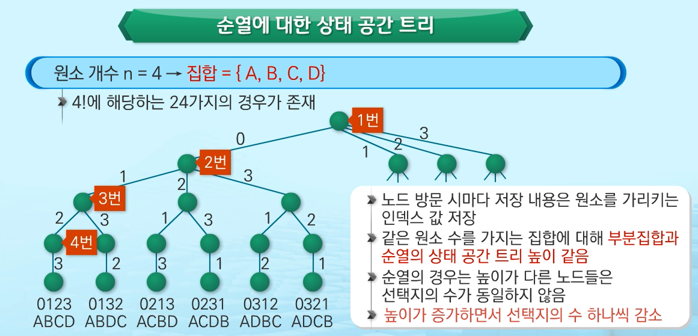

# 백트래킹


## 01. 백트래킹 (Backtracking) 기법

- 해를 찾는 도중에 **막히면** (즉, 해가 아니면) **되돌아가서** 다시 해를 찾아가는 기법

- 최적화 문제와 결정 문제를 해결할 수 있음
  - 결정문제 : 문제의 조건을 만족하는 해가 존재하는지의 여부를 `yes or no`로 답하는 문제
    - ex) 입구에서 출구까지 가는 경로가 존재하는지 묻는 문제
    - 원소의 합이 조건에 맞는 부분집합이 존재하는지 묻는 문제
  - 최적화문제
    - 미로 찾기에서 출구까지 가는 경로 중에 최단 경로를 찾는 문제
    - 원소의 개수가 최대인 부분집합을 찾는 문제


💡 초기 상태에서 목표 상태로 가는 경로를 탐색하는 기법

1. 여러가지 선택지(옵션)들이 존재하는 상황에서 한가지 선택
2. 선택이 이루어지면 새로운 선택지들의 집합 생성
3. 선택을 반복하면서 최종상태 도달

➰ 올바른 선택을 계속하면 목표상태에 도달 !


ex1 > 트리의 루트로부터 당첨이라는 단말노드까지 가는 경로 찾기


```
- 어떤 경로를 선택해야 당첨 단말 노드까지 갈 수 있는지 알 수는 없음.
- 당첨 노드까지 가기 위한 모든 경로에 대해서 탐색

< 당첨 단말 노드 찾기>
1. 루트에서 갈 수 있는 노드 선택
2. 꽝 노드까지 도달하면 최근의 선택으로 되돌아와서 다시 시작
3. 더 이상의 선택지가 없다면 이전의 선택지로 돌아가서 다른 선택
4. 루트까지 돌아갔을 경우 더 이상 선택지가 없다면 찾는 답이 없음
```


💡 **상태 공간 트리**

- 해를 찾기 위한 선택의 과정을 트리로 표현
- 트리의 내부 노드는 최종 상태로 가는 중간 상태를 나타냄
- 트리의 단말 노드는 하나의 후보해에 대한 최종상태가 됨
- 상태 공간 트리를 탐색하는 것은 모든 후보해들을 탐색하는 것
- 트리를 깊이 우선 탐색하는 방법이 백트래킹 알고리즘의 기본 형태


💡 **백트래킹과 깊이 우선 탐색과의 차이**

|                           백트래킹                           |                        깊이 우선 탐색                        |
| :----------------------------------------------------------: | :----------------------------------------------------------: |
| 어떤 노드에서 출발하는 경로가 해결책으로 이어질 것 같지 않으면 <br />더 이상 그 경로를 따라가지 않음으로써 시도의 횟수를 줄임 **(가지치기)** |                        모든 경로 추적                        |
|      백트래킹은 가지치기로 불필요한 경로를 조기에 차단       | 경우의 수가 너무 많은 경우 처리 불가능 <br />* N! 가지의 경우의 수를 가진 문제는 경우의 수가 너무 많아져서 처리 불가능 |
| 백트래킹 알고리즘 적용으로 일반적으로 경우의 수가 줄어들게 되어 처리가능<br />* 최악의 경우 여전히 지수함수시간을 필요로 하므로 처리 불가능 |                                                              |


### 8-Queens 문제


> **4-Queens 문제로 축소**
>
> - Queens들은 같은 행에 위치할 수 없음
>   - 따라서, 각 퀸에 대해 행의 위치를 미리 결정해 두고 열의 위치를 결정
> - 모든 경우의 수 : 4x4x4x4 = 256


> - 루트의 높이가 0일때, 노드의 높이가 1인 노드들 = 첫 번째 퀸의 위치가 선택된 상태 의미
> - 루트의 높이가 0일때, 노드의 높이가 2인 노드들 = 두 번째 퀸의 위치가 선택된 상태 의미


> 깊이 우선 탐색: 총 155개의 노드를 방문해야 첫 번째 해를 찾을 수 있음.
>
> 백트래킹: 27개의 노드를 방문하면 해를 찾을 수 있음. >> 수행시간 감소


- 후보해 (Candidate solution): 루트 노드에서 단말 노드까지 가는 경로
  - 깊이 우선 검색으로 후보해 중에서 해를 찾음
    - 해가 될 가능성이 전혀없는 노드의 후손노드들도 모두 검색해야 하므로 비효율적 !
  - 간선의 수 = 하나의 해로 가기위해 필요한 선택의 수


- **백트래킹(Backtraking) 기법**

  - 모든 후보해를 검사하지 않음

  - 어떤 노드의 유망성을 점검한 후 유망하지 않다고 결정되면, 해당 노드의 부모로 되돌아가 다음 자식 노드로 감

  - [^유망성]: 어떤 노드를 방문했을 때 해당 노드를 포함한 경로의 해답 여부

    - 해답이 될 수 없을 경우, 해당노드는 유망하지 않다.
    - 해답의 가능성이 있을 경우, 유망하다.

  - **가지치기 (Pruning)** : 유망하지 않은 노드가 포함되는 경로는 더 이상 고려하지 않음.

  ```
  1. 상태 공간 트리에 대한 깊이 우선 탐색 실시
  2. 방문하는 노드가 유망한지 여부 점검
  3. 만일 선택한 노드가 유망하지 않을 경우, 해당 노드의 부모 노드로 돌아가서 검색 계속 진행
  ```

  


```
v: 상태공간트리에서 현재 방문하는 노드
1: 현재 방문하는 노드의 유망성 점검
2: 단말노드에 도착하면 찾으려는 해인지 검사
3: 찾은 해 출력
4,5: 만일 단말노드가 아니라면 자식노드를 재귀호출
```


---


## 02. 부분집합


**부분집합(Power set)**

- 어떤 집합의 공집합과 자기 자신을 포함한 모든 부분집합
- 구하고자 하는 어떤 집합의 원소 개수가 n일 경우, 부분집합의 개수는 2^n


**< 백트래킹 기법으로 부분집합 구하기 >**

- 일반적인 백트래킹 접근 방법 이용
- n개의 원소가 들어있는 집합의 2^n개의 부분집합을 만들 때는, **1 또는 0 값을 가지는 항목들로 구성된 n개의 리스트**를 만드는 방법을 이용
- 리스트의 i번째 항목은 **i번째의 원소가 부분집합에 포함되는지 여부를 표현**


```python
# a[0...n-1]: 집합에 대한 비트 표현의 저장, 크기는 원소의 수
# k: 선택한 횟수(현재 노드의 높이), n: 모든 선택 수 (트리의 높이)
# 0000, 0, 4  > 0000, 1, 4 > 0000, 2, 4 > (0000, 3, 4) > (0000, 4, 4) > (0001, 4, 4) > 0010, 3, 4

def subset(a, k, n):
    if k == n:                     # 모든 선택이 끝난 상태
        process_solution(a, n)     # 원하는 작업 수행
        return
    else:                          # k가 n에 도달하지 않았다면,
        a[k] = 0                   # k번째 원소를 포함하지 않는다는 의미
        subset(a, k+1, n)          # k를 증가시킨 값을 매개변수로 재귀 호출
        a[k] = 1                   # k번째 원소를 포함한다는 의미
        subset(a, k+1, n)          # k를 증가시킨 값을 매개변수로 재귀 호출
```


---


## 03. 순열




```python
# order[]: 순열의 순서를 저장하는 리스트(원소들에 대한 인덱스 값들이 저장되어 있음)

def permutation(order, k, n):
    if k == n:               # 단말노드에 도달한 경우
        print(*order)
        return
    
    check = [False]*n        # 현재 방문중인 노드에 도달하기까지 어떤 선택을 했는지 조사하기 위해 사용
    
    # k개만큼 선택한 내용이 저장되어 있음
    for i in range(k):
        check[order[i]] = True
    
    # 원소들의 수만큼 check 리스트를 조사
    for i in range(n):
        if check[i] == False:            # i가 선택되지 않으면,
            order[k] = i                 # i를 선택
            permutation(order, k+1, n)   # 다음 선택을 위해 재귀 호출
```


---

## 04. 동전 거스름돈 문제


```python
# coin[]: 동전의 금액을 저장, choice[]: 선택한 동전들 집합
# best: 거스름돈에 대한 최소 동전 개수


def CoinChange(choice, N, money):
    global best

    if best <= N:     # 현재까지 발견된 최적의 해보다 현재 선택된 동전의 개수가 더 크면 해가 아님.
        return
    elif money == 0:  # 거스름돈 = 0: 하나의 후보해를 찾았다 !
        best = N      # 거스름돈 0원이 되는 가장 높이가 낮은 단말 노드가 최적해
    else:
        # 거스름돈이 0원이 아니면 선택을 계속함
        for i in range(len(coin)):
            if money - coin[i] >= 0:                      # 선택한 동전이 거스름돈 금액보다 작거나 같으면
                CoinChange(choice + [coin[i]], N+1, money-coin[i])    
                # 선택한 동전 저장
                # 거스름돈 금액을 선택한 동전의 금액만큼 차감


coin = [10, 50, 100, 400, 500]
best = 999999999
CoinChange([], 0, 800)
print(best)
```

