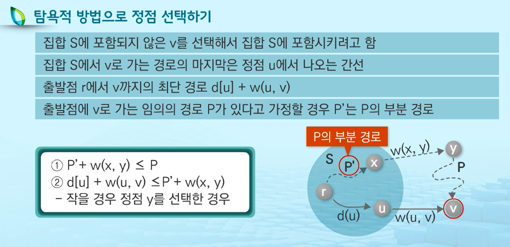
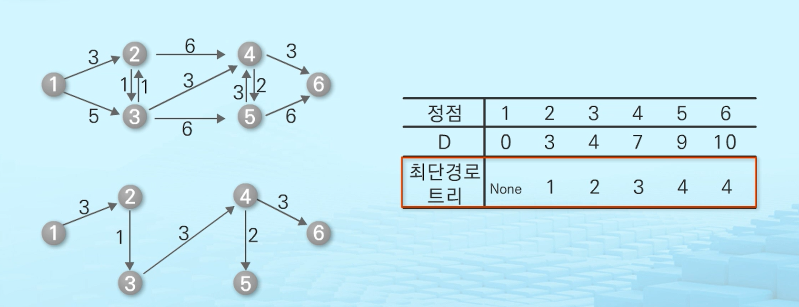

# 그래프의 최소 비용 문제 💸


## 01. 최소 신장 트리

- 그래프에서 최소 비용 문제

|                     최소 신장 트리 문제                      |                        최단 경로 문제                        |
| :----------------------------------------------------------: | :----------------------------------------------------------: |
| 가중치 그래프에서 모든 정점들을 연결하는<br />간선들의 가중치의 합이 최소가 되는 트리를 찾는 문제 | 시작 정점에서 목표 정점까지 가는<br />간선의 가중치의 합이 최소가 되는 경로를 찾는 문제 |


- **신장 트리 Spanning Tree**

  - n 개의 정점을 포함하는 무향 그래프에서 **n개의 정점과 n-1개의 간선**으로 구성된 트리

    > n = 4 개의 정점과 n-1 = 3개의 간선으로 구성된 신장 트리를 나타냄

  - 그래프에 존재하는 신장 트리의 수 => 정점의 개수와 간선의 수에 비례하여 증가


- **최소 신장 트리**
  - 가중치 그래프에서 신장 트리를 구성하는 **간선들의 가중치의 합이 최소인 신장 트리** ( 최단 거리라고 생각하면 편함 ! )


---


## 02. 프림 알고리즘

: 한 정점에 연결된 간선들 중 하나씩 선택하면서 최소 신장 트리를 만들어 가는 방식


1. 임의의 정점을 하나 선택해서 시작
2. 선택한 정점들과 인접하는 정점들 중에 최소 비용의 간선이 존재하는 정점 선택
3. 모든 정점이 선택될 때까지 두 번째 과정 반복


🗝 프림 알고리즘이 동작하기 위해서는 두 종류의 **상호 배타 집합들** (2 disjoint-sets) 정보 필요

- 트리 정점들 (Tree vertices) : 최소 신장 트리를 만들기 위해 선택된 정점들
- 비트리 정점들 (Non-Tree vertices) : 선택되지 않은 정점들


```python
def MST_PRIM(G, s):                     # G: 그래프, s: 시작점
    key = [INFINITE] * N               # 가중치를 무한대로 초기화
    pi = [None] * N                     # 트리에서 연결될 부모 정점 초기화
    visited = [False] * N               # 방문 여부 초기화
    key[s] = 0                          # 시작 정점의 가중치를 0으로 설정

    for _ in range(N):          # 정점의 개수만큼 반복
        min_idx = -1
        min = INFINITE

        # 방문 안한 정점 중 최소 가중치 정점 찾기
        for i in range(N):
            if not visited[i] and key[i] < min:
                min = key[i]
                min_idx = i
        
        visited[min_idx] = True   # 최소 가중치 정점 방문처리
        
        # 선택 정점의 인접한 정점 탐색
        # 선택 정점의 인접한 정점 중 key값보다 더 작은 가중치로 트리에 연결될 수 있는 경우,
        # 정점 v의 key를 더 작은 가중치로 업데이트
        for v, val in G[min_idx]:
            if not visited[v] and key[i] > val:
                key[v] = val          # 가중치 갱신
                pi[v] = min_idx       # 트리에서 연결될 부모정점
```


> pi 값에 저장된 내용이 최소 신장트리를 의미


---


## 03. 크루스칼 알고리즘

- 사이클이 생기지 않도록 최소 가중치 간선을 하나씩 선택해서 최소 신장 트리를 찾는 알고리즘
  - N개의 정점을 찾는 그래프에서 N-1개의 간선을 선택하는 방식 
  - 간선을 선택해 나가는 과정에 여러 개의 트리들이 존재


- 크루스칼 알고리즘 동작 과정
  1. 최초, 모든 간선을 가중치에 따라 오름차순으로 정렬
  2. 가중치가 가장 낮은 간선부터 선택하면서 트리 증가
     - 사이클이 존재하면 다음으로 가중치가 낮은 간선 선택
  3. N-1개의 간선이 선택될 때까지 두 번째 과정을 반복


```python
# 트리들을 상호배타 집합으로 관리

def MST_KRUSKAL(G):
    mst = []       # 최소 신장 트리를 구성하는 간선들의 집합 >> 최초 : 공집합
    
    for i in range(N):               # 하나의 정점을 포함하는 상호배타집합을 정점의 수 만큼 
        Make_Set(i)
        
    G.sort(key=lambda t: t[2])       # 가중치 기준으로 정렬
    
    mst_cost = 0                     # MST 가중치를 누적할 변수
    
    while len(mst) < N-1:
        u, v, val = G.pop(0)         # 최소 가중치 간선 가져오기
        
        if Find_Set(u) != Find_Set(v):  # 정점 u, v가 서로 다른 집합의 원소인지 확인
            Union(u, v)              # 정점 u, v를 합함
            mst.append((u, v))       # 트리에 u, v 추가
            mst_cost += val          # 가중치 누적
```


> 랭크 : 트리의 높이


> 두 정점의 랭크값이 같으므로, 5번 정점의 랭크값을 1로 바꿔줌


> 다음으로 가중치가 작은 1-2 간선 선택


> 이 때, 정점 6이 속한 작은 트리가 정점 2가 속한 큰트리의 하위트리로 포함되므로 랭크값의 변화가 없음.


> 정점 0이 속한 집합의 랭크 값이 작으므로 랭크값의 변화가 없음


> 두 정점이 같은 집합에 속함 (0-1) >> 선택한 간선 제외 !


> 그래프의 정점의 수 N = 7, N-1 = 6개의 간선이 선택됨
>
> p[find_set(y)] = find_set(x)


- 크루스칼 알고리즘
  - 간선 선택 과정에서 생성되는 트리를 관리하기 위해 **상호 배타 집합 사용**
    - 트리에 속한 노드들은 자신을 루트로 하는 **서브트리의 높이를 랭크(Rank)** 라는 이름으로 저장
  - 선택한 간선으로 두 개의 트리가 한 개의 트리로 합쳐질 때, **각 트리에 해당하는 상호배타집합을 Union 연산으로 합침**
    - 랭크 값이 작은 트리를 랭크 값이 큰 트리의 서브트리로 포함시킬 경우 **트리에 포함된 노드들의 랭크 값 수정 불필요**


---


## 04. 최단 경로

- 간선의 가중치가 있는 유향 그래프에서 두 정점 사이의 경로들 중 간선의 가중치의 합이 최소인 경로


- 단일 시작점 최단 경로 문제
  - 출발점에서 다른 모든 정점들에 이르는 최단 경로를 구하는 문제
    - 다익스트라 알고리즘 : 음의 가중치를 허용하지 않음
    - 벨만-포드 알고리즘 : 음의 가중치 허용. 가중치 합이 음인 사이클은 허용 X


- 모든 쌍 최단 경로 문제
  - 모든 정점 쌍 간의 최단 경로를 구하는 것으로 플로이드-워샬 알고리즘 이용


---


## 05. 다익스트라 알고리즘

- 시작정점에서 거리가 최소인 정점부터 선택해 나가면서 최단 경로를 구하는 방식
- 탐욕 기법을 사용한 알고리즘으로 최소 신장 트리를 구하는 프림 알고리즘과 유사
- 시작정점(r)에서 끝 정점(t)까지의 최단 경로에 정점 x가 존재
  - 최단경로는 r에서 x까지의 최단 경로와 x에서 t까지의 최단 경로로 구성


> d : 가중치를 저장한 변수
>
> d[v] = ∞ 로 초기화. 계산을 거치며 최단거리로 바꿔준다 !





```python
# D: 출발점에서 각 정점까지 최단 경로 가중치 합을 저장
# P: 최단 경로 트리 저장

def Dijkstra(G, r):         # G: 그래프, r: 시작 정점
    D = [INF] * N           # 모든 정점들의 가중치를 저장할 리스트 (초기화: 무한대)
    P = [None] * N          # 이전 경로를 저장할 리스트(최단 경로 추출 시, 사용)
    visited = [False] * N   # 그래프의 각 정점에 대해 방문여부를 저장할 리스트
    D[r] = 0                # 출발지 r에 대한 가중치 값
    
    for _ in range(N):
        minIndex= -1
        min = INF
        
        for i in range(N):       # 방문하는 정점 중 최소 가중치 정점을 찾는다.
            if not visited[i] and D[i] < min:
                min = D[i]
                minIndex = i
        visited[minIndex] = True  # 최소 가중치 정점 방문 처리
        
        for v, val in G[minIndex]:  # 선택 정점에 인접한 정점에 대해 반복
        	# 방문하는 정점 중 선택하는 정점의 가중치 + 간선의 가중치 < v의 가중치면,
            # 선택한 정점을 거쳐 정점 v에 이르는 경로의 가중치 합 < 지금까지 찾은 출발점에서 정점 v까지 최단 경로 가중치 합
            # 더 짧은 경로로 갱신 (추후, 최단 경로를 추출할 때 사용하기 위해 이전 경로를 갱신)
        	if not visited[v] and D[minIndex] + val < D[v]:
                D[v] = D[minIndex] + val
                P[v] = minIndex
```





< 음의 가중치가 있을 경우 >


---


# 06. 벨만-포드 알고리즘

- 음의 가중치를 포함하는 그래프에서 최단 경로를 구함
  - 가중치의 합이 음인 사이클은 허용하지 않음
  - 다익스트라로 최단 경로를 구할 수 있다면 벨만-포드로 가능(역은 알 수 없음)
- 출발점에서 각 정점까지 간선 하나로 구성된 경로만 고려해서 최단 경로를 구함
- 최대 간선 두 개까지 고려해서 최단 경로를 구해나가서 최대 간선 n-1개까지 고려한 경로들에서 최단 경로를 구함(n은 정점의 개수)
  - 동적 계획법 적용
- 다익스트라에 비해 많은 시간 소요ㄴ
