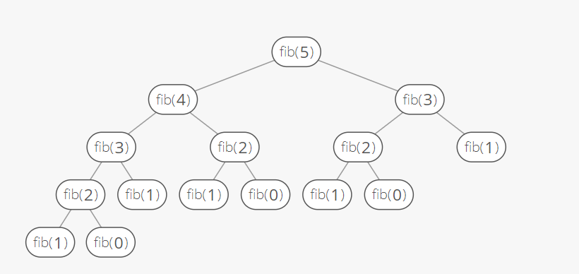

# Stack1 (알고리즘 스터디)

## 목차

- 스택
- 재귀호출
- Memoization & DP
- DFS


## 스택의 특성

- 스택에 저장된 자료는 선형 구조를 갖는다. 
  - 선형구조 : 자료 간의 관계가 1대1의 관계를 갖는다. 
  - 비선형구조 : 자료 간의 관계가 1대N의 관계를 갖는다. (예 : 트리 ) 

- 스택에 자료를 삽입하거나 자료를 꺼낼 수 있다.
- <span style = "color: red"> **후입선출**</span>, 마지막에 삽입한 자료를 가장 먼저 꺼낸다.
  - ex) 1,2,3 순으로 자료를 넣으면 3,2,1 순으로 꺼냄


## 스택의 구현

- #### 스택을 프로그램에서 구현하기 위해서 <span style='color : green'>**자료구조**</span>와 <span style='color : brown'>**연산**</span>

  - 자료구조 : 자료를 선형으로 저장할 저장소 (=<span style='color :red'>**스택**</span>)

    - 배열 사용 가능

    - 마지막에 삽입된 원소의 위치를 top이라 부름

      

  - 연산 

    - 삽입(push) : 저장소에서 자료를 저장. 
    - 삭제(pop) : 저장소에서 자료를 꺼냄
    - 스택의 공백 확인 : isEmpty
    - top에 있는 item 반환 : peek


###  삭제/삽입 과정


#### - 스택의 push 알고리즘

```python
# 스택을 List로 구현
def push(item):
	s.append(item)
```

```python
# push 사용법 예시
def push(item, size):
	global top
    top += 1
    if top == size:
        print('overflow')
     else:
        stack[top] = item

# 스택의 size는 10이다.         
size = 10
stack = [0] * size # 배열로 생성
top = -1 # 스택의 층 수 

push(10, size) # 10이란 아이템을 스택에 넣겠다.
top += 1 # 그리고 그 위층에 
stack[top] = 20 # 20이란 아이템을 넣겠다.

>>> stack = [10, 20, 0, 0, ...]

# 배열처럼 사용 하는 이유 : 리스트의 크기를 변경하면 내부적으로 큰 overhead 발생 작업으로 많은 시간이 소요 
# (overhead설명: https://gamestory2.tistory.com/15)
```


#### - 스택의 pop 알고리즘

```python
def pop():
    # 스택에 아무 것도 없다면
    if len(s) == 0: 
        # underflow
        return
    # 내용물이 있다면
    else: 
        # 가장 마지막에 들어간 값을 pop
        return s.pop(-1)
```

```python
# pop 사용법 예시
def push(item):
    s.append(item)

def pop():
    if len(s) == 0:
        print("Stack is Empty") # underflow
    
    else: 
        return s.pop(-1)
    
s = []

push(1)
push(2)

print("pop item => ". pop())
```


## 스택의 응용1 : 괄호검사

- 조건 
  - 왼쪽 괄호의 개수와 오른쪽 괄호의 개수가 같아야 한다.
  - 같은 괄호에서 왼쪽 괄호는 오른쪽 괄호보다 먼저 나와야 한다. 
  - 괄호 사이에는 포함 관계만 존재한다.

```python
EX)
if( ( i == 0 ) && (j == 0 )

# 괄호가 열린만큼 닫혀야 하는데 위 코드는 괄호가 하나 남음
```


- #### 함수를 호출하면 스택에 쌓이게 되고, 복귀를 하면 top부터 제거 된다. 


## Memoization

: 컴퓨터 프로그램을 실행할 때 이전에 계산한 값을 메모리에 저장해서 매번 다시 계산하지 않도록 하여 실행속도를 빠르게 하는 기술.
**동적 계획법(DP)**의 핵심이 되는 기술.

- 재귀함수

  

 <**Memoization X**>



```python
def fibo(n):
    if n <2 :
        return n
    
    else :
        return fibo(n-1) + fibo(n-2)
        
a = fibo(6)
```


<**Memoization**>


```python
# 만약 기존에 계산하여 저장된 값이 있을 경우에는 다시 계산하지 않겠다는 알고리즘

def fibo1(n):
    global memo
    
    if n >= 2 and len(memo) <=n:
        memo.append(fibo1(n-1) + fibo1(n-2))
    return memo[n]
    
memo = [0,1]
a = fibo1(6)
print(a)
```


## 동적 계획 (Dynamic programming)

: 그리디 알고리즘과 같이 <span style = "color: red">최적화 문제</span>를 해결하는 알고리즘
그래프 구조(비선형구조)는 그래프로 표현된 모든 자료를 빠짐없이 검색하는 것이 중요. 


#### - DP를 이용해 피보나치 수열을 구해보자


```python
def fibo2(n):
	f = [0,1]
    
    for i in ragne(2, n+1):
        f.append(f[i-1]+f[1-2])
        
	ruturn f[n]
```


### - DFS와 BFS

- 깊이 우선 탐색(Depth First Search, DFS)

  

  :  인접한 노드로 방문을 반복하면서 방문하지 않은 곳이 없을 때까지 진행한다. 
  
  ```
  깊이 제한에 도달할 때까지 목표노드가 발견되지 않으면 최근에 첨가된 노드의 부모노드로 되돌아와서, 부모노드에 이전과는 다른 동작자를 적용하여 새로운 자식노드를 생성한다.
  여기서 부모노드로 되돌아오는 과정을 백트래킹 이라 한다.
  ```


# Stack2

