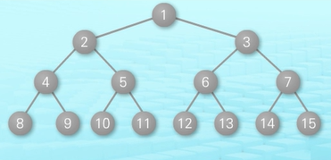

# TREE

## 1. Tree의 개념

비선형 구조로 원소들 간에 1:n 관계를 가지는 자료구조 


## 2. Tree의 특성

한 개 이상의 노드로 이루어져 있고, 
노드 중 최상위 노드를 'Root', 나머지는 'SubTree' 라고함


### 1) 구성요소

___

#### 노드 

형제노드 :  같은 세대에 있는 노드 (B-C-D)
조상노드 :  ex) K의 조상 노드 (F, B, A)
서브트리 :  부모 노드와 연결된 간선을 끊었을 때 생성되는 트리
자손노드 :  서브트리에 있는 하위 레벨의 노드.  ex) B의 자손노드 : E F K

#### 차수

: 노드에 연결된 자식 노드의 수 

B의 차수 = 2 
C의 차수 = 1

<트리에 있는 노드의 차수 중에서 가장 큰 값>
D의 자식노드가 가장 많으므로 
**트리 T의 차수 = 3** 

#### 높이 

: 노드의 레벨

B의 높이 = 1 
G의 높이 = 2


## 3. 이진 트리 (Binary Tree) 

모든 노드들이 0~2개의 서브트리(자식)를 갖는 트리


### 1) 포화 이진 트리 (Full Binary Tree)

모든 레벨에 노드가 포화상태로 차 있는 이진 트리



```
트리의 높이(h)=3
2^(h+1)-1 = 15 개의 노드를 가짐
```


### 2) 완전 이진 트리 (Complete Binary Tree)


```
1) 완전 이진트리는 마지막 레벨을 제외 하고 모든 레벨이 완전히 채워져 있다.
2) 마지막 레벨은 꽉 차 있지 않아도 되지만, 노드가 왼쪽에서 오른쪽으로 채워져야 한다.
3) 마지막 레벨 h에서 1~2h-1 개의 노드를 가질 수 있다.
4) 완전 이진 트리는 배열을 사용해 효율적으로 표현 가능하다.
```


### 3) 편향 이진 트리 (Sekwed binary Tree)


```
높이(h)에 대한 최소 개수의 노드를 가지며 한쪽 방향의 자식 노드만을 가짐
```


## 4. 순회 (Travel)

### 1) 전위 순회 (Preorder traversal)


```python
def preorder_traversal(T): 
	if T: # T가 None이 아니라면
        visit(T)
        preorder_traverse(T.left)
        preorder_traverse(T,right)
```

### 2) 중위 순회 (Inorder Traversal)


```python
def inorder_traverse(T)
	if T:
        inorder_traverse(T.left)
        visit(T)
        inorder_traverse(T.right)
```

### 3) 후위 순회 트리 (Postorder Traversal)


```python
def postorder_traverse(T)
	if T:
	postorder_traverse(T.left)
	postorder_traverse(T.right)
	visit(T)
```


## 5. Binary search Tree

1) 탐색 연산


```
13을 탐색하고 싶다 
start!
탐색 값 13 보다 9가 더 작다 -> 오른쪽 노드로 이동
탐색 값 13 보다 12가 더 작다 -> 오른쪽 노드로 이동
탐색 값 13 보다 15가 더 크다 -> 왼쪽 노드로 이동
13 찾았네
stop!
```

2. 삽입 연산


```
5를 삽입하고 싶다!
삽입 값 5보다 9가 더 크다 -> 왼쪽 노드로 이동
삽입 값 5보다 4가 더 작다 -> 오른쪽 노드로 이동
삽입 값 5보다 6이 더 큰데 왼쪽 노드엔 더 이상 찾을 노드가 없다 -> 검색 실패 
실패한 자리에 5를 넣는다!
```


## 6. Heap 

: 완전 이진 트리에 있는 노드 중에서 키값이 가장 큰 노드나 
  키값이 가장 작은 노드를 찾기 위해서 만든 자료구조

```
1. 우선 순위 큐의 구현시 가장 많이 쓰는 구조
2. 왼쪽 자식 노드 인덱스 = 부모 노드 인덱스 * 2
   오른쪽 자식 노드 인덱스 = 부모 노드 인덱스 * 2 + 1
```


 

### 1) 힙의 연산 

- 삽입

  

  

  

```
위 힙은 최대 힙,
임시로 빈 자리에 23을 삽입한다.
부모노드와 비교해서 크기에 맞게 위치를 서로 바꾼다. 
최종적으로 root에 가장 큰 값이 오면 자리를 확정한다.
```


- 삭제

```
삭제 연산은 루트 노드의 원소만을 삭제 할 수 있고, 
힙의 종류에 따라 최대값 또는 최소값을 구할 수 있다.
```


```
우선 루트 원소를 삭제 하고,
마지막 노드를 루트로 이동 시킨다.
그리고 자식 노드와 크기를 비교해 가며 위치를 이동 시킨다.
끝
```


## 7. Tree 구현


```python
class Node:
    def __init__(self, data, left_node, right_node):
        self.data = data
        self.left_node = left_node
        self.right_node = right_node

# 전위 순회
def pre_order(node):
    print(node.data, end=' ')
    if node.left_node != None:
        pre_order(tree[node.left_node])
    if node.right_node != None:
        pre_order(tree[node.right_node])

# 중위 순회
def in_order(node):
    if node.left_node != None:
        in_order(tree[node.left_node])
    print(node.data, end=' ')
    if node.right_node != None:
        in_order(tree[node.right_node])

# 후위 순회
def post_order(node):
    if node.left_node != None:
        post_order(tree[node.left_node])
    if node.right_node != None:
        post_order(tree[node.right_node])
    print(node.data, end= ' ')

# 노드의 갯수
n = int(input())
tree = {}

for i in range(n):
    # data = 본인 노드, left_node = 왼쪽 자식, right_node = 오른쪽 자식
    data, left_node, right_node = input().split()

    # 자식이 없는 노드의 경우
    if left_node == "None":
        left_node = None
    if right_node == "None":
        right_node = None
    tree[data] = Node(data, left_node, right_node)


pre_order(tree['A'])
print()
in_order(tree['A'])
print()
post_order(tree['A'])


# 입력 예시
7
A B C
B D E
C F G
D None None
E None None
F None None
G None None
```

