# 분할정복

## 1. 개념

- 분할 : 해결할 문제를 여러개의 작은 부분 문제들로 분할
- 정복 : 나눈 작은 문제를 각각 해결
- 통합 : 필요 시 해결된 해답을 모음

 

### 일반 적인 재귀와 차이점

일반적인 재귀는 한 조각 씩 나누고, 
분할정복은 거의 캍은 크기의 부분 문제로 나눈다


## 2. 예시 

### 1) 거듭제곱

```python
def Recursive_Power(C, n):
    if n == 1:
        return C
    if n % 2 == 0:
        y = Recursive_Power(C, n/2)
        return y*y
    else:
        y = Recursive_Power(C, (n-1)/2)
        return y*y*C

print(Recursive_Power(2, 5)) # C=2, n=5
# C^5 = C^2 * C^2 * C
```

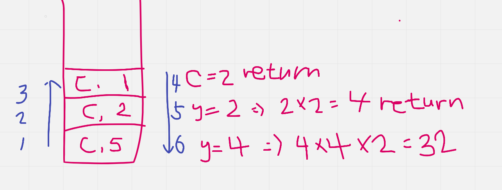


### 2) 병합 정렬

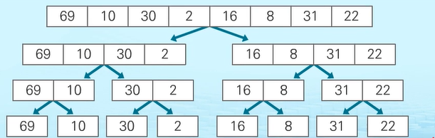

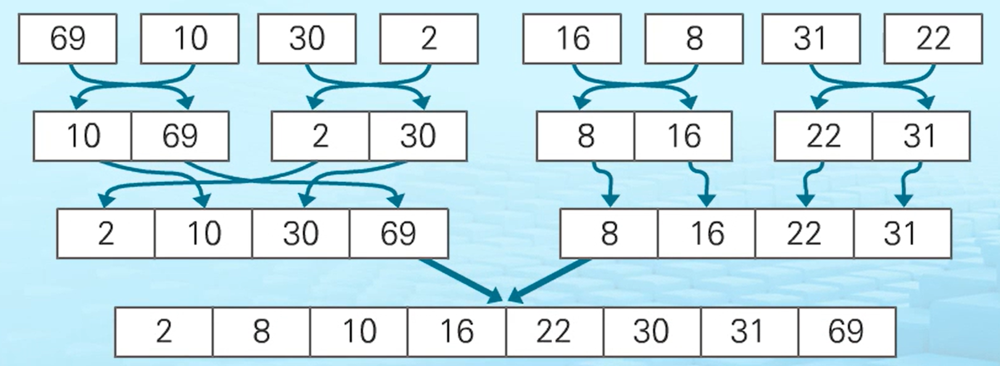

```python
def merge_sort(m):
	if len(m) <= 1:
        return m
    
    # 1. 분할
    mid = len(m) // 2
    left = m[:mid]
    right = m[mid:]
    
    left = merge_sort(left)
    right = merge_sort(right)
    
    # 2. 정복 : 분할된 리스트들 병합
    return merge(left, right)


def merge(left, right):
    result = []
    
    # 왼쪽 리스트와 오른 쪽 리스트가 빌 때 까지 반복
    while len(left)>0 and len(right)>0:
        # 오른쪽 값이 크면 왼쪽 값 먼저 추가
        if left[0] <= right[0]:
            result.append(left.pop(0))
        else:
            result.append(right.pop(0))
            
	# 왼쪽 또는 오른쪽 리스트에 나머지 값들은 extend로 추가한다.            
    if len(left)>0:
       result.extend(left)
     
    if len(right)>0:
       result.extend(right)
    
    return result

print(merge_sort([69, 10, 30, 2, 16, 8, 31, 22]))
```

(참고) append vs extend

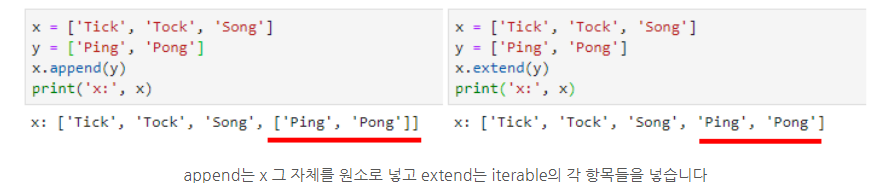


### 3) 퀵정렬 

#### 호어 파티션 정렬

```
i 인덱스는 오른쪽으로 탐색하면서 피봇보다 큰 값을 찾고,
j 인덱스는 왼쪽으로 탐색하면서 피봇보다 작은 값을 찾는다. 

그 값을 찾았을 때 
1) i 가 j 보다 왼쪽에 있다면, i와 j 둘의 위치를 바꾼다. 
2) i가 j를 지나 쳐서 오른쪽에 있다면, j와 피봇을 바꿔 준다.
```

```python
def partition(A, l, r):
    if l == r:
        return
    
    p = A[l]
    i = l + 1
    j = r
    while i <= j:
        # i가 j 보다 왼쪽에 있고, 피봇보다 큰 값을 찾을 때 까지 반복
        while i <= j and A[i] <= p:
            i += 1
        # i가 j 보다 왼쪽에 있고, 피봇보다 큰 값을 찾을 때 까지 반복    
        while i <= j and A[j] >= p:
            j -= 1

        # 1) i 
        if i <= j:
            A[i], A[j] = A[j], A[i]
    # 2)
    A[l], A[j] = A[j], A[l]
    
    return partition(A, j+1, len(A)-1)

A = [3, 2, 4, 6, 9, 1, 8, 7, 5]
partition(A, 0, len(A) - 1)
print(A)


# 교재 퀵소트 연습문제 코드
'''
11 45 23 81 28 34
11 45 22 81 23 34 99 22 17 8
1 1 1 1 1 0 0 0 0 0
'''

def QuickSort(A, l, r):
    if l < r:
        s = partition(A, l, r) # s = 새로운 피봇
        QuickSort(A, l, s - 1) # s 기준 왼쪽 정렬을 위한 재귀
        QuickSort(A, s + 1, r) # s 기준 오른쪽 정렬을 위한 재귀


def partition(A, l, r):
    if l >= r:
        return

    pivot = A[l]      # 피봇값
    i = l + 1         # 피봇의 왼쪽 인덱스부터 탐색
    j = r             # 피봇의 오른쪽 인덱스부터 탐색

    while i <= j:
        # 피봇보다 큰 값이 나올 때까지 i 증가
        while i <= j and A[i] <= pivot:
            i += 1

        # 피봇보다 작은 값이 나올 때까지 j 감소
        while i <= j and A[j] >= pivot:
            j -= 1

        if i < j:
            A[i], A[j] = A[j], A[i]

    A[l], A[j] = A[j], A[l]
	
    # 피봇을 반환
    return j


T = 3
for tc in range(1, T+1):
    nums = list(map(int, input().split()))
    QuickSort(nums, 0, len(nums)-1)
    print(nums)
```

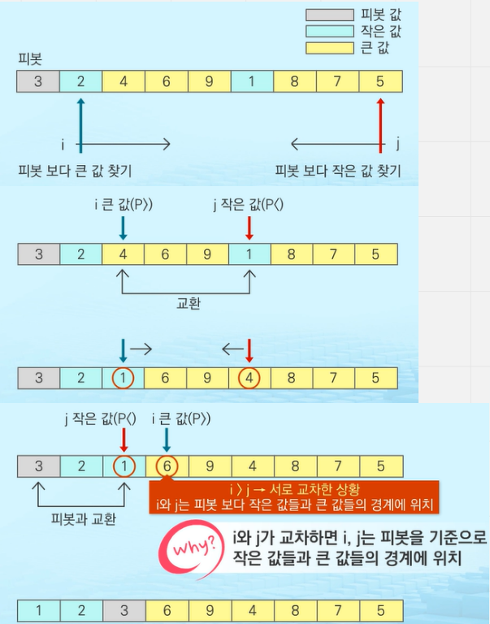


#### 로무토 파티션


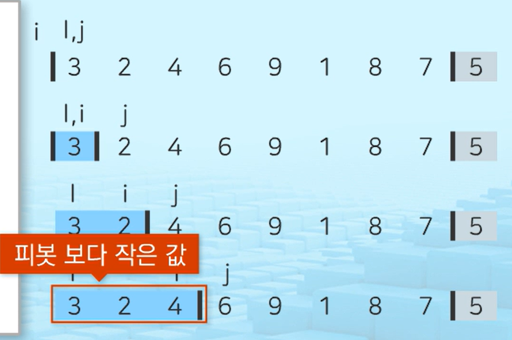

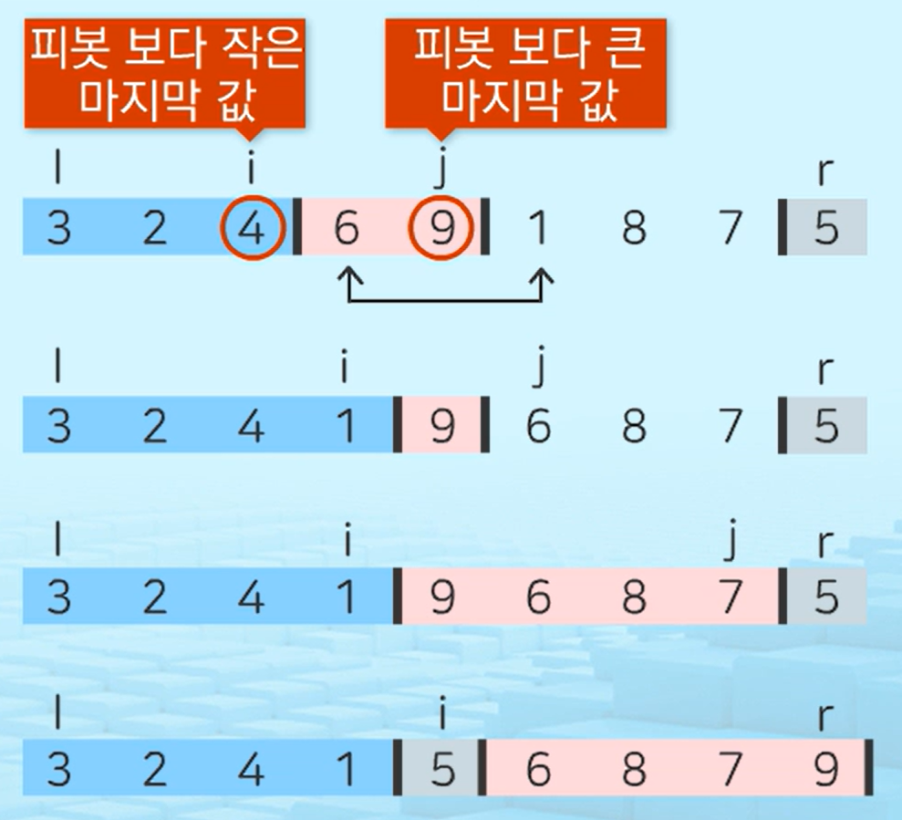

과정 

1. 피봇은 무조건 오른쪽 끝 값으로 잡는다. 
2. i = -1 , j = 0 부터 시작 
3. 피봇보다 작은 값이 j에 걸리면 i를 1 올린다. 
4. 피봇보다 큰 값이 j에 걸리면 j만 올린다. 
5. 그러다가 다시 j에 피봇보다 작은 값이 걸리면 i를 1 올리고 i와 j의 자리를 교환한다. 

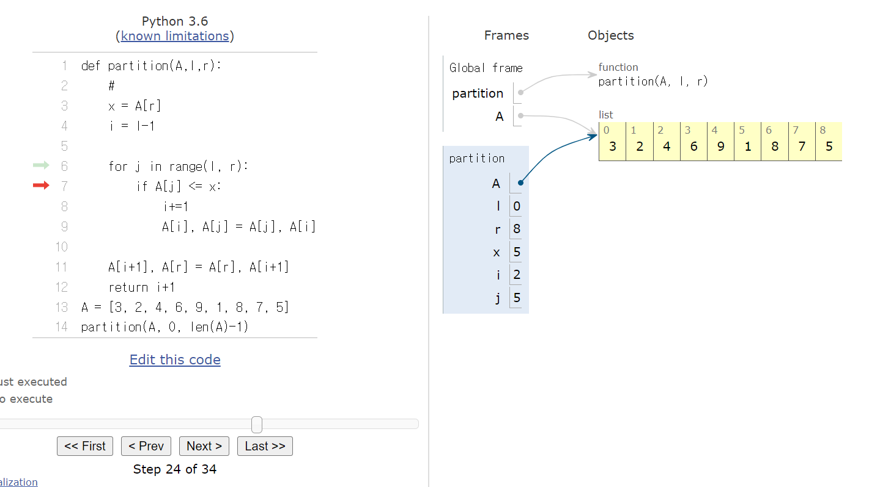

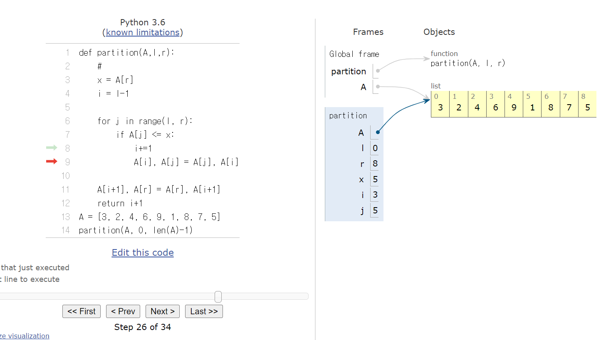

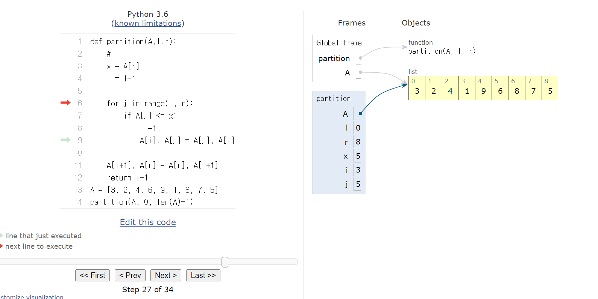


```python
# i : 피봇보다 작은 마지막 값
# j : 피봇보다 큰 마지막 값 

def partition(A,l,r):
	# 
    x = A[r]
    i = l-1
    
    for j in range(l, r):
        if A[j] <= x:
            i+=1
            A[i], A[j] = A[j], A[i]
            
	A[i+1], A[r] = A[r], A[i+1]
    return i+1
A = [3, 2, 4, 6, 9, 1, 8, 7, 5]
partition(A, 0, len(A)-1)


# 전체 코드 (중첩함수...)
def quicksort(A, lo, hi): # 중첩함수
    def partition(lo, hi):
        pivot = A[hi] # 맨 오른쪽 
        left = lo
        for right in range(lo, hi):
            if A[right] < pivot:
                A[left], A[right] = A[right], A[left] # swap
                left += 1
        
        A[left], A[hi] = A[hi], A[left] # swap
        return left
    
    if lo < hi: 
        pivot = partition(lo, hi)
        quicksort(A, lo, pivot - 1)
        quicksort(A, pivot + 1, hi) 
        
A = [3, 2, 4, 6, 9, 1, 8, 7, 5]
quicksort(A, 0, len(A)-1)
```


### 5) 이진검색

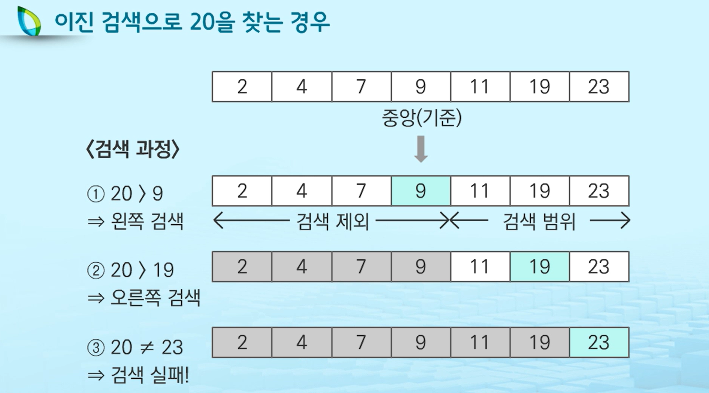

이진 검색의 검색 과정

1. 자료의 중앙에 있는 원소를 고른다.

2. 중앙 원소의 값과 찾고자 하는 목표 값을 비교한다.

3. 목표 값과 중앙 원소값의 관계

​		3-1 목표 값 < 중앙 원소 값 일때

​			- 자료의 왼쪽 반에 대해서 새로 검색을 수행한다.

​		3-2 목표 값 > 중앙 원소 값

​			- 자료의 오른쪽 반에 대해서 새로 검색 수행

4. 찾고자 하는 값을 찾을 때까지 1-3의 과정 반복한다

```python
def binarySearch(a,key):
    start = 0
    end = len(a)-1
    
    # start가 end 보다 작은 동안 반복 하겠다. 
    while start <=end:
        middle = start + (end-start)//2
        if key== a[middle]: # 검색 성공
            return middle
        # 목표 값이 중앙원소 값보다 작을 때 end를 갱신하므로써 왼쪽 부분 탐색
        elif key < a[middle]:
            end = middle-1
        # 목표 값이 중앙원소 값보다 클 때 start를 갱신하므로써 오른쪽 부분 탐색
        else : #a[middle] <key
            start = middle + 1
    return -1 # 검색 실패
```

